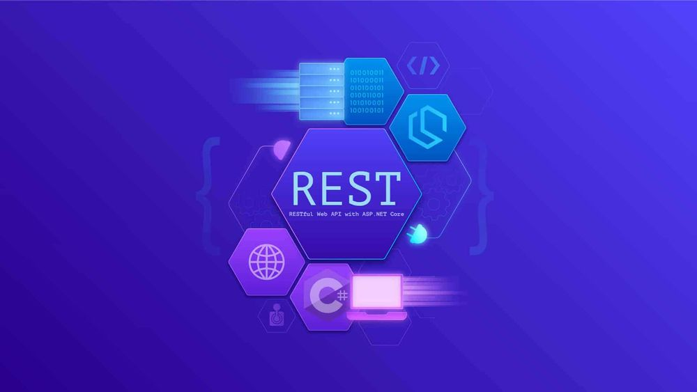

<h2 align="center">  API CORE NETCORE </h2>
<!-- https://shields.io/ -->

  </a>
    

[A tour of the C# language](https://docs.microsoft.com/en-us/dotnet/csharp/tour-of-csharp/)

<table align="center" >
  <tr>
    <td align="center" style="padding=0;width=50%;">
      
    </td>
  </tr>
</table>	 

**Intall**

📦  [Postman](https://www.postman.com/)  
📦  [Insomnia](https://insomnia.rest/)  

## GET

http://localhost:5265/api/Producto/Lista
http://localhost:5265/api/Producto/Obtener/1
## POST

{
  "idProducto": 0,
  "codigoBarra": "0101",
  "nombre": "demo",
  "marca": "demo",
  "categoria": "demo",
  "precio": 10
}
 

 ## PUT

 http://localhost:5265/api/Producto/Editar

 ## Eliminar

 http://localhost:5265/api/Producto/Eliminar/13

## GET ID

[HttpGet]
        [Route("Obtener/{idProducto:int}")]
        public IActionResult Obtener(int idProducto)
        {
            List<Producto> lista = new List<Producto>();
            Producto producto = new Producto();

            try
            {
                using (var conexion = new SqlConnection(CadenaSQL))
                {

                    conexion.Open();
                    var cmd = new SqlCommand("sp_lista_productos", conexion);
                    cmd.CommandType = CommandType.StoredProcedure;

                    using (var rd = cmd.ExecuteReader())
                    {

                        while (rd.Read())
                        {
                            lista.Add(new Producto()
                            {

                                IdProducto = Convert.ToInt32(rd["IdProducto"]),
                                CodigoBarra = rd["CodigoBarra"].ToString(),
                                Nombre = rd["Nombre"].ToString(),
                                Marca = rd["Marca"].ToString(),
                                Categoria = rd["Categoria"].ToString(),
                                Precio = Convert.ToDecimal(rd["Precio"])
                            });
                        }
                    }
                }
                producto = lista.Where(item => item.IdProducto == idProducto).FirstOrDefault();

                return StatusCode(StatusCodes.Status200OK, new { mensaje = "ok", response = producto });
            }
            catch (Exception error)
            {
                return StatusCode(StatusCodes.Status500InternalServerError, new { mensaje = error.Message, response = producto });
            }

        }

## PUT

[HttpPost]
        [Route("Guardar")]
        public IActionResult Guardar([FromBody] Producto objeto)
        {
            try
            {

                using (var conexion = new SqlConnection(CadenaSQL))
                {
                    conexion.Open();
                    var cmd = new SqlCommand("sp_guardar_producto", conexion);
                    cmd.Parameters.AddWithValue("codigoBarra", objeto.CodigoBarra);
                    cmd.Parameters.AddWithValue("nombre", objeto.Nombre);
                    cmd.Parameters.AddWithValue("marca", objeto.Marca);
                    cmd.Parameters.AddWithValue("categoria", objeto.Categoria);
                    cmd.Parameters.AddWithValue("precio", objeto.Precio);
                    cmd.CommandType = CommandType.StoredProcedure;
                    cmd.ExecuteNonQuery();
                }

                return StatusCode(StatusCodes.Status200OK, new { mensaje = "agregado" });
            }
            catch (Exception error)
            {

                return StatusCode(StatusCodes.Status500InternalServerError, new { mensaje = error.Message });

            }
        }
